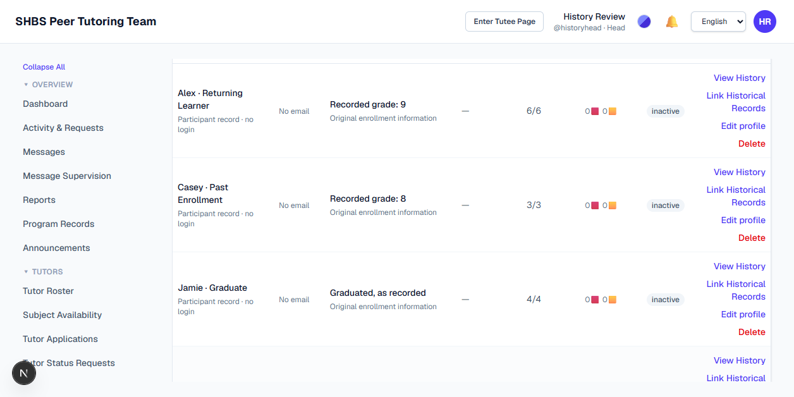
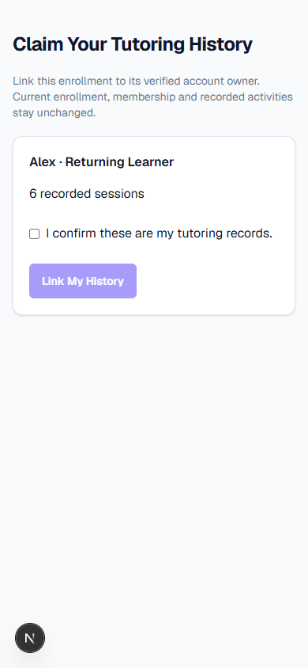
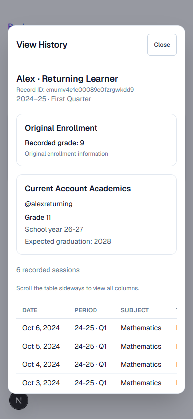
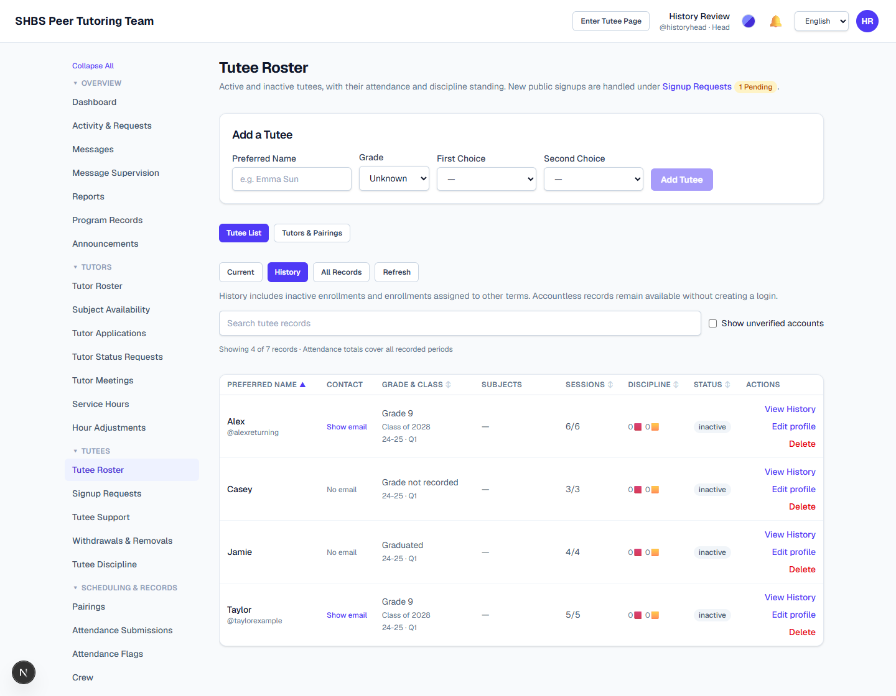
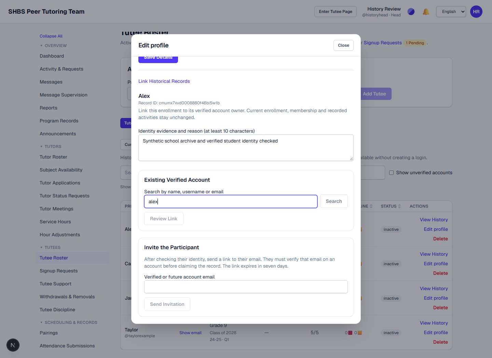

# Historical participant transition: website audit

Synthetic data only. Captured September 29–30, 2026, after integrating departure access and preferred/legal names from main.

## Verified website actions

- Staff opened History, found an accountless record, sent an exact-record invitation, and saw the sent confirmation. Local development email output supplied the test link; no real email was sent.
- The participant opened that link while signed out, used Sign In, and returned to the exact claim. No ownership was written on inspection.
- Explicit acknowledgement enabled Link My History. Confirmation linked the intended six-session record and opened personal history.
- Database assertions proved that the transferred participant's revoked observer access, current enrollment fields, all 18 session rows, 18 attendance rows, one meeting, one meeting attendance and one hour amendment stayed unchanged. The invitation was consumed.
- Staff corrected an accountless historical grade to 8 using Edit profile. The roster immediately showed grade 8 with the same inactive status and 3/3 attendance.
- Fresh roster load and profile save after the batch fix logged zero console errors. Mobile history was 390px wide without page overflow, with 44px navigation targets.

## Inconsistencies found and corrected

1. Sign-in discarded the invitation destination; the claim now supplies the validated local callback route.
2. Historical grade sorting used current account academics; sorting now uses the original grade displayed in each historical row.
3. A busy roster could exceed ingress's 20-operation batch limit and rely on retries. Client batching now shares that bound with ingress. A transport test exercises 43 simultaneous operations as 20 + 20 + 3 through real ingress.
4. Invitation tests depended on a developer's AUTH_URL; fixtures now set a synthetic origin and explicitly test unavailable delivery.
5. Current tutoring signup could be confused with account creation for historical access. The invitation page explicitly labels it Request Current Tutoring and explains its consequence.

## Validation

- Full integrated local suite before final audit fixes: 2,032 tests passed across 233 files.
- Final affected regression after audit fixes: 79 tests passed across nine files, including real PostgreSQL history/departure/merge tests, transport batching and website interaction tests.
- Repository check passed with 18 existing lint warnings and no errors. Final added code passed TypeScript and targeted lint. Documentation checks passed.
- The first GitHub CI run caught the missing test origin; it was fixed rather than waived. Consult the PR checks for final CI status.

The complete [website action matrix](../../historical-participant-transition.md#website-action-coverage) distinguishes implemented controls from follow-ups. Bulk academic correction remains #195. There is no dedicated history-only signup for an accountless alumnus; existing archive access for staff does not require creating a login. The original imported ZIP was unavailable, so these are synthetic checks rather than a reconciliation of production records.

## Screenshots

## Tutee table refinement (follow-up to #204)

- The Tutee List uses Users & Roles table spacing, typography and action sizes. Each writable row has exactly View History, Edit Profile and Delete; linking/invitations are inside Edit Profile.
- Grade & Class retains original enrollment grade/period for historical records. A class year requires a numeric grade and known school year. Confirmed current account academics remain separate.
- Browser verification linked Alex's synthetic historical enrollment through Edit Profile. The dialog remained open, unsaved notes survived, focus returned to the link summary, and the roster refreshed. No nested forms or dialogs.
- Desktop actions measured 28px and mobile actions 44px. At 390px the page remained 390px wide; only the table scrolls horizontally. Browser console and uncaught-error checks were clear.
- 28 UI tests and 15 real PostgreSQL history tests passed. TypeScript and repository check passed (18 existing lint warnings); 13 documentation checks passed.
- Updated local HTML report: `outputs/historical-participant-transition/audit.html`. It embeds fresh desktop/mobile screenshots, the Users & Roles reference and measured interaction evidence. Historical reports describe previous verification runs.

