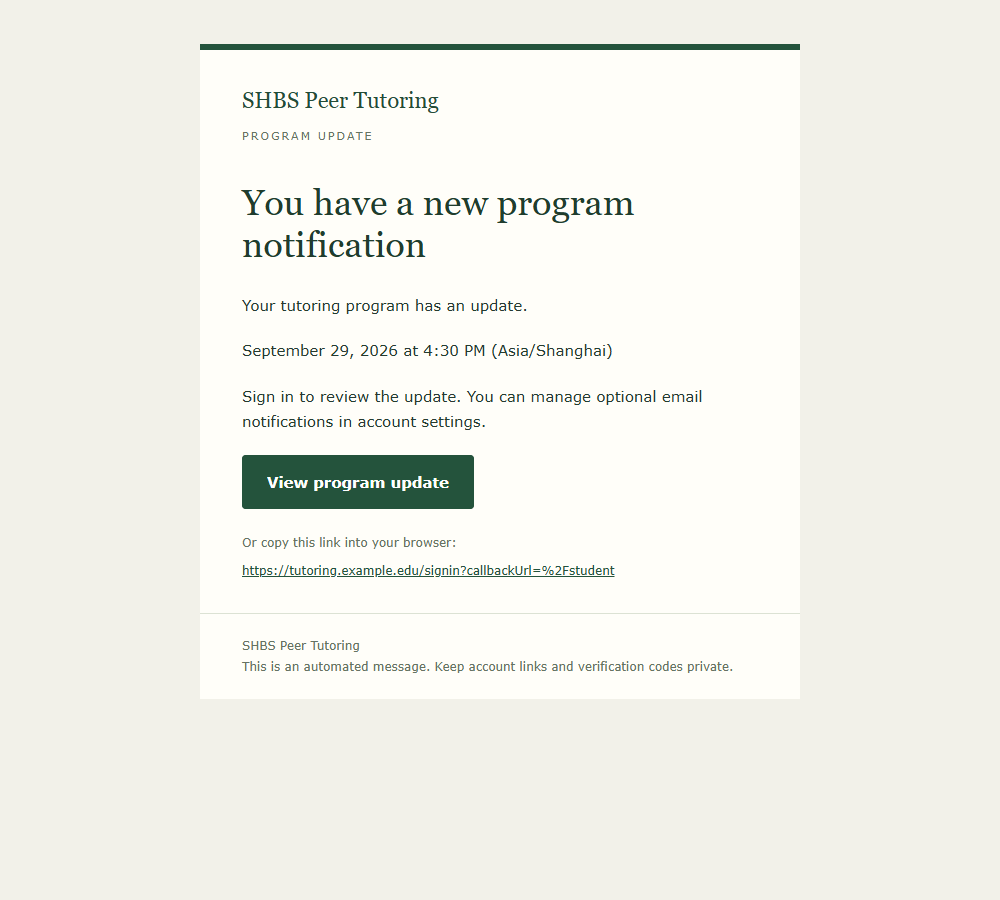
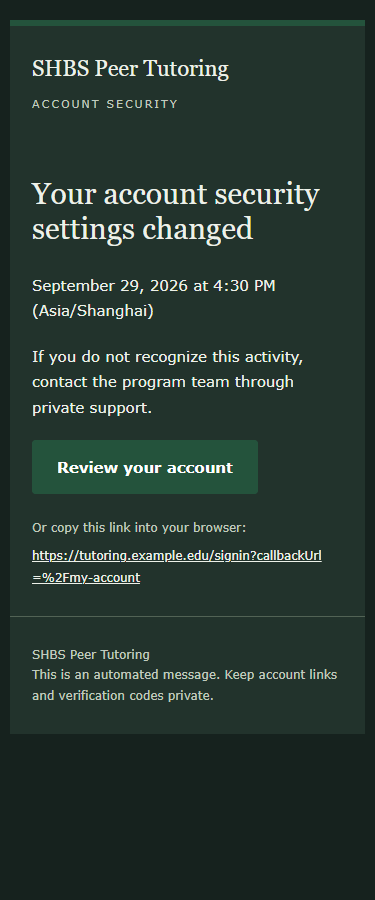
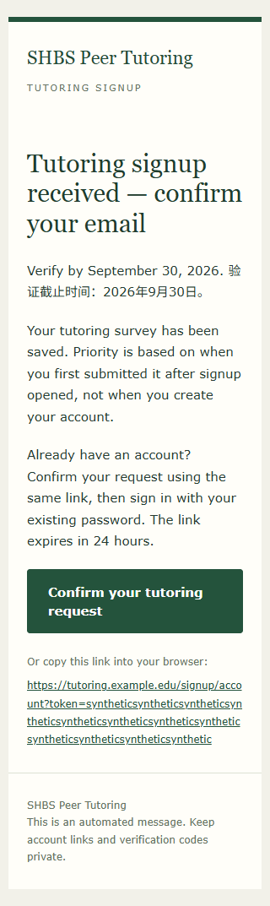

# Email notification redesign verification

Issue: [#192](https://github.com/DupeisTaken/shbs-peer-tutoring-website/issues/192).
Verified locally on 2026-09-29 using synthetic accounts and a disposable database.

- 164 targeted tests passed across 13 files: template escaping, text/HTML action parity, URL validation, atomic queue destinations, retries, account email and signup lifecycles, sign-in, session recovery, branding and role-aware message routing.
- 13 documentation tests, changed-file ESLint, full TypeScript and whitespace checks passed.
- All 49 migrations applied to a fresh local PostgreSQL database, including the destination migration.
- Browser checks passed for password and email-2FA sign-in and authenticated email clicks; destination query parameters and fragments survived.
- Preview screenshots checked at 1000, 375 and 320 CSS pixels, including dark mode and bilingual signup text. No horizontal overflow; action targets measured 54 px, or 76 px when wrapping.

Recreate offline synthetic previews with `npx tsx scripts/preview-emails.ts`.
These are browser screenshots, not actual inbox-rendering evidence. Real-inbox delivery and representative mail-client rendering remain rollout checks. No external messages were sent and production was not changed during verification.

Apply `20260929120000_email_notification_destinations`, regenerate Prisma and restart the worker together. See the [deployment guide](../../deployment.md#optional-notification-delivery) for URL configuration and fallback behavior.
